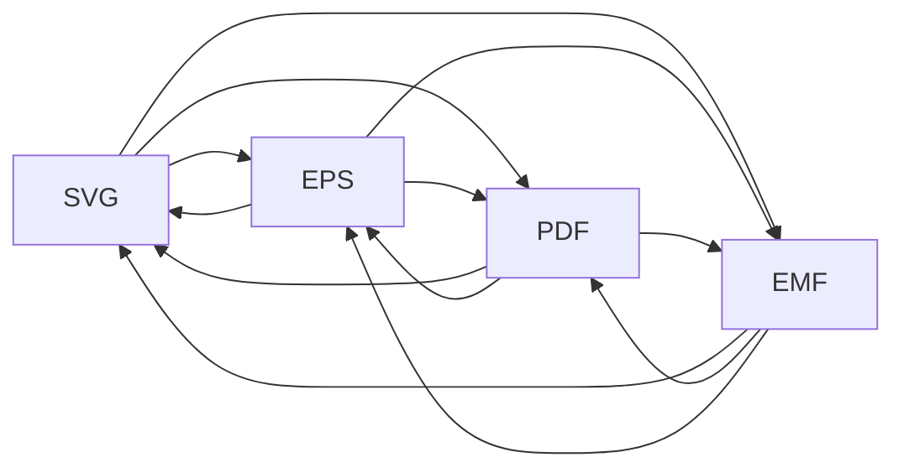
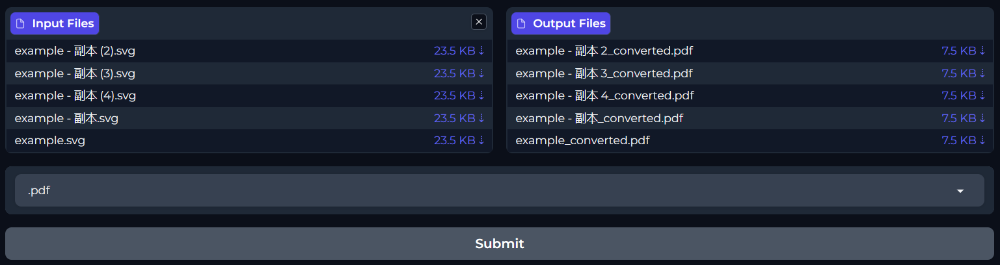

# v2v

**Vector to Vector 😊** 

Interconversion between mainstream vector graphics formats as follows, driven by **Inkscape, Ghostscript** and **pdf2svg**, accessed by WebUI built by **Gradio**
- [x] SVG

- [x] EPS
- [x] PDF
- [x] EMF



## How to Use

### 1. Install converter Dependencies

#### Ubuntu

```shell
sudo add-apt-repository ppa:inkscape.dev/stable
sudo apt update
sudo apt install inkscape ghostscript pdf2svg
```

#### Windows

Install following tools by yourself, and add their executable to system PATH respectively:

- [Inkscape](https://inkscape.org/)
- [Ghostscript](https://ghostscript.com/index.html)
- [pdf2svg-windows](https://github.com/jalios/pdf2svg-windows)

### 2. Install fastapi for API access

```shell
pip install fastapi[standard]
```

### 3. Install Gradio for WebUI access
```shell
pip install Gradio
```

### 4. Start Web Server

```shell
uvicorn serve:app --port 8005 --host 0.0.0.0
```

### 5. Access by WebUI

```shell
python ui.py
```

Visit http://127.0.0.1/8006 for your conversion.


